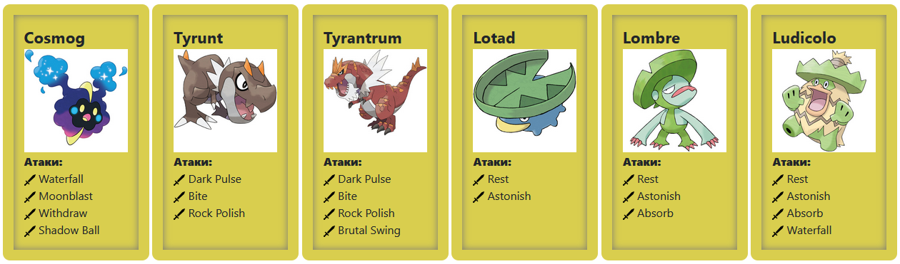

  

<em>Инфохимия</em>

<strong>Лабораторная работа №2  
По дисциплине : «Программирование» 
Вариант 221562</strong>

Преподаватель: <strong>Райла Мартин</strong> 
Выполнил: <strong>Дьяконов Александр</strong> 
Группа: <strong>O3143</strong>

# Лабораторная работа #2

## 1. Задача
На основе базового класса Pokemon написать свои классы для заданных видов покемонов. Каждый вид покемона должен иметь один или два типа и стандартные базовые характеристики:

    очки здоровья (HP)
    атака (attack)
    защита (defense)
    специальная атака (special attack)
    специальная защита (special defense)
    скорость (speed)

Классы покемонов должны наследоваться в соответствии с цепочкой эволюции покемонов. На основе базовых классов PhysicalMove, SpecialMove и StatusMove реализовать свои классы для заданных видов атак.

Атака должна иметь стандартные тип, силу (power) и точность (accuracy). Должны быть реализованы стандартные эффекты атаки. Назначить каждому виду покемонов атаки в соответствии с вариантом. Уровень покемона выбирается минимально необходимым для всех реализованных атак.

Используя класс симуляции боя Battle, создать 2 команды покемонов (каждый покемон должен иметь имя) и запустить бой.

Базовые классы и симулятор сражения находятся в jar-архиве (обновлен 9.10.2018, исправлен баг с добавлением атак и кодировкой). Документация в формате javadoc - здесь.

Информацию о покемонах, цепочках эволюции и атаках была взята с http://pokemondb.net

## 2. Покемоны

